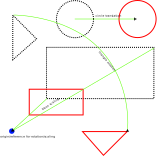

# Hausübung 4 (2 Punkte)

**Ausgabe**: Dienstag 14. April 2026, vormittags.

**Abgabe bis**: Montag 27. April 2026, Ende des Tages.

**Abgabe via**: git-Repository mit dem Namen **`exercise4`** auf unserem git-Server https://sgit.iue.tuwien.ac.at

```shell
# create your own fork as ususal (example https://sgit.iue.tuwien.ac.at/eXXXXXXXX/exercise4)
git config --global credential.helper "cache --timeout 300"
git clone --recursive https://sgit.iue.tuwien.ac.at/eXXXXXXXX/exercise4.git
git submodule update --init --recursive # important: populates the ./include folder
```

---

In dieser Hausübung werden Sie grundlegende mathematische Operationen für 2D-Geometrien implementieren und diese anschließend nutzen, um grafische Elemente (SVGs) zu generieren.

## Strukture und bereitgestellte Dateien

Alle Quelldateien für diese Übung befinden sich im `src/`-Ordner.
Einige Dateien sind bereits vollständig implementiert und dienen Ihnen als Hilfsmittel:
* Alle Dateien, die auf `*misc.hpp` enden (z. B. `task2.misc.hpp`, `task3.misc.hpp`), stellen vorgefertigte Hilfsfunktionen bereit (z.B. für Konsolenausgaben oder Vergleiche).
* Der Ordner `include/` enthält externe Abhängigkeiten (z. B. für Zufallszahlen und das SVG-Rendering).
* **Sie müssen diese Hilfsdateien nicht bearbeiten.**

Achten Sie in den zu bearbeitenden Dateien auf die `/// @todo`-Kommentare, die Ihnen genau sagen, wo Ihr Code eingefügt werden muss.

---

## Task 1: Einfache 2D-Rotation (keine Punkte)
**Datei:** `src/task1.main.cpp`

Ihre erste Aufgabe ist es, ein einfaches, in sich geschlossenes C++-Programm zu vervollständigen.
1. Implementieren Sie die Funktion `rotate_counter_clockwise`. Diese nimmt eine 2D-Koordinate (`std::array<double, 2>`) sowie einen Rotationswinkel (in Bogenmaß) entgegen und dreht den Punkt gegen den Uhrzeigersinn um den Koordinatenursprung `(0,0)`.
2. Nutzen Sie Ihre neue Funktion innerhalb der `main()`-Funktion, um die Punkte `{112, 211}` und `{-42, 23}` um 180 Grad (also $\pi$) zu drehen.
3. Geben Sie das Ergebnis der Rotation übersichtlich auf der Konsole aus.

---

## Task 2: Geometrische Grundformen (1 Punkt)
**Dateien:** `src/task2.hpp` und `src/task2.cpp`

In dieser Aufgabe implementieren Sie die Logik für drei grundlegende 2D-Formen: 
- Eine achsenparallele Bounding Box (`BBox`), 
- einen Kreis (`Circle`) und
- ein Dreieck (`Triangle`).

Öffnen Sie die Datei `src/task2.cpp` und implementieren Sie die fehlende Funktionalitaet für alle drei Klassen:
* **`scale`**: Skaliert die Form basierend auf einem Referenzpunkt (`org`) und einem Skalierungsfaktor (`s`).
* **`translate`**: Verschiebt die Form um einen gegebenen Vektor (`offset`).
* **`rotate`** *(nur für Circle und Triangle)*: Rotiert die Form gegen den Uhrzeigersinn um einen Referenzpunkt (`org`).
* **`bbox`** *(nur für Circle und Triangle)*: Berechnet die minimal umgebende, achsenparallele Bounding Box für die Form.
* **`check_invariants`**: Überprüft, ob die Geometrie gültig ist (z. B. dass der Radius nicht negativ ist, keine Koordinaten `NAN` sind und die Eckpunkte eines Dreiecks nicht alle auf derselben Koordinate liegen).

**Tests:** Sie können Ihre Implementierung testen, indem Sie `src/task2.test.cpp` kompilieren und ausführen. Diese Datei enthält vorbereitete Assertions, die Ihre Funktionen auf Korrektheit prüfen.

**Visualisierung** der Transformationsfunktionen (`translate/scale/rotate`):



---

## Task 3: Kreatives SVG-Rendering (1 Punkt)
**Datei:** `src/task3.cpp`

Nutzen Sie Ihre Klassen aus Task 2, um ein Bild im SVG-Format zu zeichnen.

Implementieren Sie die Funktion `render_something` in `src/task3.cpp`:
1. Erzeugen Sie C++-Container (z.B. `std::vector`), um Instanzen von Bounding Boxes, Kreisen und Dreiecken zu speichern.
2. Nutzen Sie Ihre zuvor implementierten Methoden (`scale`, `translate`, `rotate`), um die Objekte logisch anzuordnen oder Muster zu erzeugen.
3. **Bedingung:** Sie müssen insgesamt **mindestens 200 geometrische Objekte** generieren.
4. Übergeben Sie Ihre Objekte an die vorgegebene Hilfsfunktion `task3::render_wrapper`, die das eigentliche Schreiben der SVG-Datei in den übergebenen Dateipfad übernimmt.
5. Geben Sie die Gesamtzahl der generierten Objekte als Rückgabewert der Funktion zurück.

**Hinweis:** Wenn Sie möchten, können Sie die bereitgestellten Zufallsgeneratoren aus `iue-rnd/random.hpp` verwenden, um Formen in zufälliger Größe und an zufälligen Positionen zu platzieren. 

**Tests:**  Testen Sie Ihre Implementierung mit `src/task3.test.cpp`. Das erzeugte SVG-Bild landet im angegebenen Ordner und kann einfach in jedem modernen Webbrowser geöffnet und betrachtet werden.

**Beispiele:**

- Horizontal verschobene und skalierte "Häuser" mit "Himmel" aus zufällig angeordneten Kreisen:
	
- Horizontal verschobene "Lokomotiven":
	

---

> **SUBMITTED BY:**
> - **Name:** Henadii Chalyi
> - **Student ID (Matrikelnummer):** [12344365]
> - **E-Mail:** e12344365@student.tuwien.ac.at
> - **Status:** All tasks (1, 2, 3) successfully completed and tested.